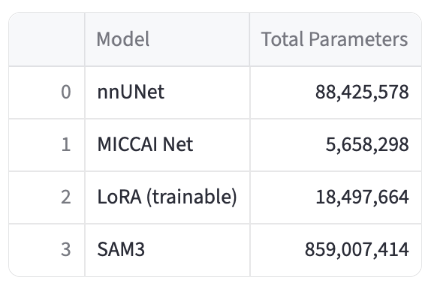
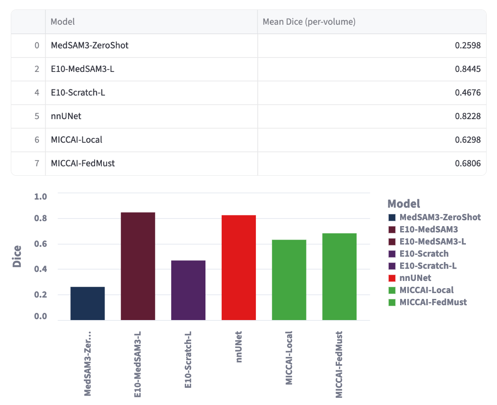
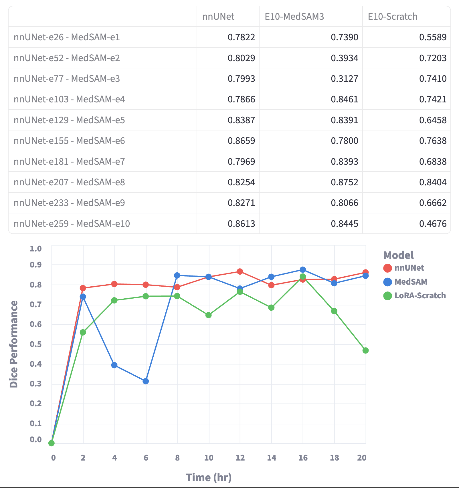

# Foundation Model Fine-tunning + Inference: 

## Fine-Tunning MedSAM3 (SAM3+LoRA) on the 3D Nifti dataset:

Clone the [main repository](https://github.com/Joey-S-Liu/MedSAM3.git) and download the `sam3.pt` checkpoint, as well as the MedSAM3 LoRA weight model from Hugging Face (Facebook). Move the YAML file `configs/full_lora_config_3d_nifti.yaml` to the corresponding folder `MedSAM3/configs/` in the repository, and copy the remaining files in this directory to the main folder of the repo (e.g., copy `train_sam3_lora_native_3d_nifti.py` to the `MedSAM3/` directory).

* **Download SAM3 model weights:**  `https://huggingface.co/facebook/sam3/tree/main`
* **Download MedSAM3 Lora weights:** `git clone https://huggingface.co/lal-Joey/MedSAM3_v1`
* **GitHub Repository:** [MedSAM3 on GitHub](https://github.com/Joey-S-Liu/MedSAM3)
* **Paper:** [ArXiv](https://arxiv.org/abs/2511.19046)


The database working directory and the text prompt can be set in the config file under the training section using `data_dir` and `text_prompt`, respectively. The required data folder structure should be as follows: `imagesTr` and `labelsTr` contain the training NIfTI files, while `imagesTs` and `labelsTs` contain the validation data.

```
workdir/  
├── dataset/  
│   └── Task09_Spleen/  
│       ├── imagesTr/ 
│       │   ├── t0001.nii.gz
│       │   └── ...
│       ├── labelsTr/ 
│       │   ├── t0001.nii.gz
│       │   └── ...
│       ├── imagesTs/
│       │   ├── v0001.nii.gz
│       │   └── ...
└──     └── labelsTs/ 
            ├── v0001.nii.gz
            └── ... 
```

The training can be run using where config and sam3_chkdir point at the used configuration and the directory of the sam3 checkpoint model on the local computer where if you want the training to insted of starting LoRA block from the scratch from the MedSAM3 weight you set the init_lora_weights variable to the locally saved weights. After you can set  the number of epochs and the limits on the number of training and validation images (not setting num_images uses all the available niftis in the folder). Use all_slices to sue all slices, empty and non-empty in terainig while not using would train only on the non-empty ones. and setting save_model_every_epoch save the model checkpoint after every epoch. 

Training can be run by specifying the `config` and setting `sam3_chkdir` to point to the selected configuration and the directory of the SAM3 checkpoint model on the local machine. If you want to initialize the LoRA block with pre-trained MedSAM3 weights instead of starting from scratch, set the `init_lora_weights` variable to the path of the locally saved weights.

You can then configure the number of epochs and set limits on the number of training and validation images (if `num_images` is not specified, all available NIfTI files in the folder are used). Use `all_slices` to include all slices (both empty and non-empty) during training; otherwise, only non-empty slices are used. Setting `save_model_every_epoch` will save a model checkpoint after each epoch.

```bash
CONFIG_DIR="configs/full_lora_config_3d_nifti.yaml"
SAM3_CHKPOINT="/workspace/checkpoints/sam3.pt"
INIT_LORA_WEIGHTS="/workspace/checkpoints/MedSAM3_v1/best_lora_weights.pt"
OUTPUT_DIR="/workspace/output"

python train_sam3_lora_native_3d_nifti.py \
    --config $CONFIG_DIR \
    --sam3_chkdir $SAM3_CHKPOINT \
    --init_lora_weights $INIT_LORA_WEIGHTS \
    --output_dir $OUTPUT_DIR \
    --num_epochs 10 \
    --num_images 100 100 \
    --all_slices \
    --save_model_every_epoch
```

## Inference on the 3D NIfTI dataset:
To run inference and compute the 3D Dice score on a set of 3D NIfTI images, specify `weights` as the path to the saved LoRA weights to be evaluated. The test images and labels should be provided via `images_dir` and `labels_dir`. The number of images can be limited using `num_images` (by default, all images are evaluated). If visualization of the predictions is desired, set `visualize`. By default, predictions are performed only on non-empty slices; setting `all_slices` forces inference on all slices and the prediction files are saved unless `no_save_nifti` is enabled.

```bash
CONFIG_DIR="configs/full_lora_config_3d_nifti.yaml"
SAM3_CHKPOINT="/workspace/checkpoints/sam3.pt"
LORA_CHKPOINT_DIR="/workspace/output/best_lora_weights.pt"
INPUT_DIR="/workspace/dataset/imagesTs"
LABEL_DIR="/workspace/dataset/labelsTs"
OUTPUT_IMG="/workspace/output/infer"
TEST_NUM=50

# Inference SAM3
python infer_sam3_plus_lora_3d_nifti.py \
    --config $CONFIG_DIR \
    --sam3_chk $SAM3_CHKPOINT \
    --weights $LORA_CHKPOINT_DIR \
    --images_dir $INPUT_DIR \
    --labels_dir $LABEL_DIR \
    --prompt "spleen" \
    --num_images $TEST_NUM \
    --visualize \
    --all_slices \
    --no_save_nifti \
    --output_dir $OUTPUT_IMG 
```

## Results: comparing the Spleen segmentation performance with nnUNet
We train a 3D segmentation model on CT data to segment the spleen using the [Medical Segmentation Decathlon](http://medicaldecathlon.com/) Spleen CT dataset, which includes 41 3D CT images, for E=10 epochs in two different scenarios:

- Train SAM3 + LoRA starting from the MedSAM3 weights for E=10 epochs  
- Train SAM3 + LoRA with random LoRA initialization for E=10 epochs  

The trained models are then compared with ensemble models trained by nnUNet using 5-fold cross-validation. The following shows the inference results tested on the AMOS CT test set, which includes 276 images, compared to MedSAM3 zero-shot testing and the models trained in our student-teacher federated learning framework - MICCAI submission (smaller models than nnUNet). A summary of the number of parameters in each model is also provided.

<p align="center">
  
</p>

<p align="center">
  
</p>

## Training time analysis:
To train for one epoch (freezing SAM3 and updating only the LoRA weights), the SAM3+LoRA models take approximately 120 minutes, while nnUNet completes training for one epoch-fold in about 55 seconds, which for 5 folds is roughly 275 seconds. To compare model performance after the same amount of time, we saved checkpoints for the SAM3+LoRA models after each epoch and for nnUNet every 26 epochs, which approximately corresponds to the time taken for one epoch of the foundation model to be updated. The following shows the 3D Dice scores for saved checkpoints evaluated on the AMOS test set.

<p align="center">
  
</p>


© Ashkan M.,  
Released under the MIT License
